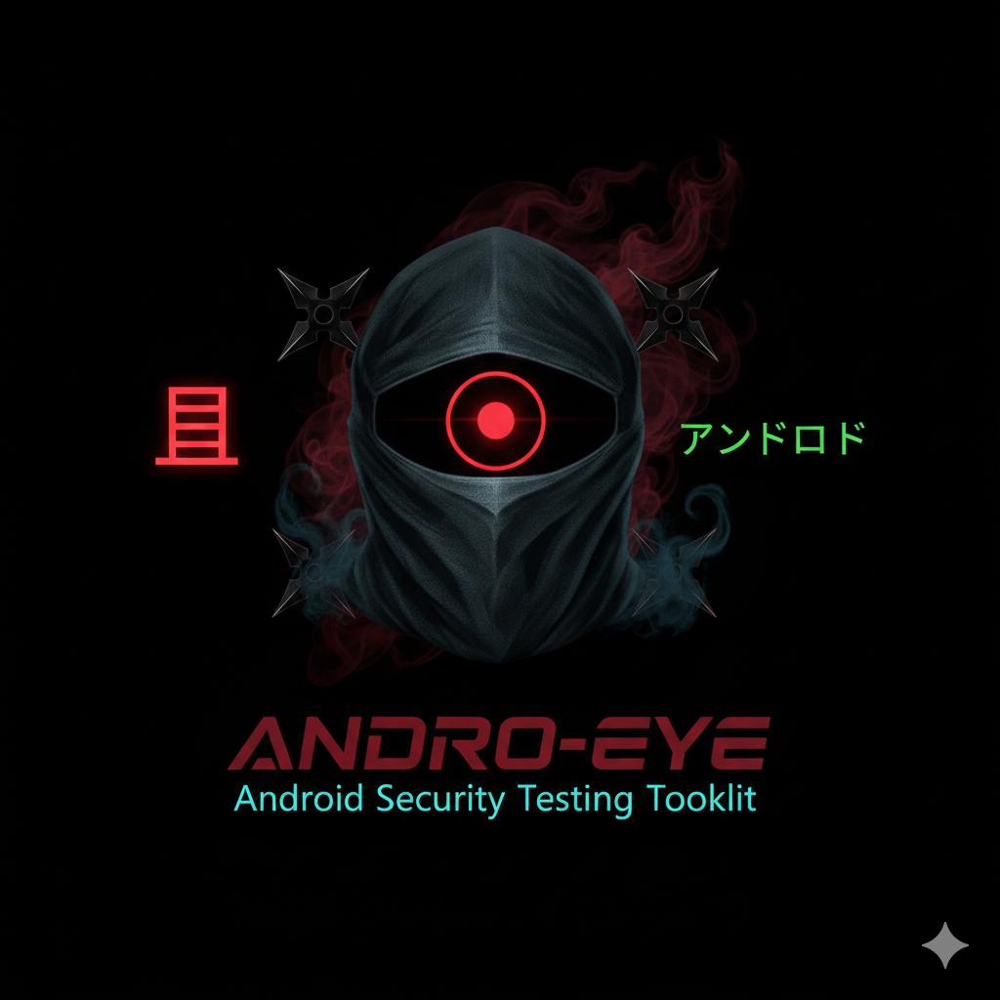

<a href="https://github.com/Athexhacker/ANDRO-EYE"></a> 


# ANDRO-EYE - Android Security Testing Toolkit


# ⚠️ DISCLAIMER
FOR EDUCATIONAL PURPOSES ONLY - This tool is designed for security professionals, researchers, and educators to test Android devices in controlled environments. Unauthorized use against devices you don't own or don't have permission to test is illegal. The developers assume no liability and are not responsible for any misuse or damage caused by this program.

# 📋 Table of Contents
Overview
Features
Installation
Requirements
Usage
Module Documentation
Screenshots
Contributing
License
Author

# 🔍 Overview
ANDRO-EYE is a comprehensive Bash-based Android security testing toolkit that provides over 29 different functions to interact with Android devices via ADB (Android Debug Bridge). It features beautiful animations, color-coded output, and user-friendly interfaces for various Android testing and analysis tasks.

**✨ Features**
🎨 Visual Enhancements
Color-coded output - Easy-to-read colored terminal output

Loading animations - Spinners, progress bars, and visual feedback

Device information boxes - Beautifully formatted device displays

Sparkle effects - Visual transitions and success indicators

Countdown timers - For destructive operations

**🛠️ Core Functionality**
29+ modules - Comprehensive Android device interaction

Multi-device support - Handle up to 3 devices simultaneously

Error handling - Robust error checking and user feedback

Input validation - Validates all user inputs

Progress tracking - Real-time operation progress

**🔧 Technical Features**
Modular design - Each function in separate script

Consistent color scheme - Standardized across all modules

Cross-platform - Works on Linux and macOS

Self-contained - Minimal dependencies

Update checker - Automatic version verification

# 📦 Installation
Quick Install
bash
```
git clone https://github.com/Athexhacker/ANDRO-EYE.git
cd ANDRO-EYE
sudo bash install.sh

```
Manual Installation
bash
# Install dependencies
# For Debian/Ubuntu
```
sudo apt-get install adb fastboot ruby-full
```
# For Arch
```
sudo pacman -S android-tools ruby metasploit
```
# For CentOS/RHEL
```
sudo yum install android-tools ruby
```
# Clone and setup
```
git clone https://github.com/Athexhacker/ANDRO-EYE.git
cd ANDRO-EYE
chmod +x ANDRO-EYE.sh
mkdir .temp
```
# Optional: Add alias
echo "alias ANDRO-EYE='cd $PWD && sudo bash ANDRO-EYE.sh'" >> ~/.bash_aliases
source ~/.bash_aliases
**🔧 Requirements**
System Requirements
OS: Linux (Ubuntu/Debian, Arch, CentOS, Fedora) or macOS

Bash: Version 4.0 or higher

ADB: Android Debug Bridge

Fastboot: Fastboot tools

Ruby: For Metasploit integration (optional)

Root access: For installation

Android Device Requirements
USB Debugging enabled

Device authorized for ADB

Android 4.0+

USB drivers installed (Windows)

***🚀 Usage***
Basic Usage
bash
**Run with sudo**
sudo ./ANDRO-EYE.sh

**Or if alias installed**
sudo ANDRO-EYE
Command Line Options
bash
sudo bash ANDRO-EYE.sh [option]

Options:
  install, -i, -install    Install ANDRO-EYE and dependencies
  help, -h, --help        Show help message
Main Menu Navigation
The tool presents a numbered menu with 29 options. Simply enter the number of the desired function.

# 📚 Module Documentation
Device Information & Management
Option	Module	Description	Key Features
1	opt1.sh	Show Connected Devices	Lists all connected devices with model info, device boxes, real-time scanning
2	opt2.sh	Restart ADB Service	Kills and restarts ADB server, shows device count before/after
3	opt3.sh	Reboot System	Reboots device with countdown, confirmation prompts
4	opt4.sh	Reboot to Recovery	Boots into recovery mode, educational info about recovery
5	opt5.sh	Reboot to Bootloader	Boots into fastboot mode, fastboot command suggestions
6	opt6.sh	Interactive Shell	Opens ADB shell with command guide, device state verification
10	opt10.sh	Get Phone Details	Detailed device info dashboard, system properties viewer
System Information Dumps
Option	Module	Description	Key Features
7	opt7.sh	Dump System Info	Complete system dump, progress indicator, file statistics
8	opt8.sh	Dump CPU Info	CPU information with real-time preview, top processes
9	opt9.sh	Dump Memory Info	Memory analysis, RAM usage, top memory consumers
11	opt11.sh	Capture Bug Report	System bug report with progress animation, file info
15	opt15.sh	Live Log Viewer	Real-time logcat with filtering, colored output
Package Management
Option	Module	Description	Key Features
12	opt12.sh	Install APK	APK installation with file picker, app launch option
13	opt13.sh	Uninstall Package	Package removal with package listing, confirmation
14	opt14.sh	List All Packages	Installed apps viewer with search, CSV export
26	opt26.sh	Launch Application	App launcher with package browser, app info display
Data Extraction
Option	Module	Description	Key Features
17	opt17.sh	Screenshot Capture	Anonymous screenshot with preview, multiple viewers
18	opt18.sh	Screen Recording	Video capture with timer, playback option
19	opt19.sh	Copy Camera Photos	DCIM folder download with progress, file statistics
20	opt20.sh	Copy Downloads	Downloads folder extraction, file type analysis
21	opt21.sh	Copy WhatsApp Data	WhatsApp backup with selective copying, data analysis
22	opt22.sh	Copy All Storage	Full device backup with warnings, folder-by-folder
23	opt23.sh	Copy File/Folder	Selective copy with interactive browser, path validation
24	opt24.sh	Push File to Device	File upload with local/device browser, transfer progress
Network & Remote
Option	Module	Description	Key Features
16	opt16.sh	Remote Connection	Wireless ADB with IP detection, connectivity testing
Security Testing
Option	Module	Description	Key Features
25	function2.sh	Metasploit Section	Payload generator, listener, launcher
27	opt27.sh	Root Checker	Multi-method root detection, confidence scoring
28	opt28.sh	Hang the Phone	Device freeze test with triple confirmation
29	opt29.sh	Send SMS	SMS sender with validation, message preview
Utilities
Option	Module	Description	Key Features
A	about.sh	About Author	Developer info, social links, educational notice
Metasploit Sub-Modules
Option	Module	Description
1	2opt1.sh	Show connected devices
2	2opt2.sh	Create and install Metasploit payload
3	2opt3.sh	Launch the Metasploit package
4	2opt4.sh	Launch Metasploit listener
5	-	Return to main ADB-Toolkit
**🎯 Use Cases**
Security Research
Test device security configurations

Analyze app permissions and behaviors

Practice penetration testing techniques

Digital Forensics
Extract device information

Capture screenshots and recordings

Copy user data for analysis

Development & Testing
Test apps on multiple devices

Debug with logcat viewer

Install/uninstall apps remotely

Education
Learn Android internals

Understand ADB commands

Practice ethical hacking


Free for educational use

Not for commercial purposes

No warranty provided

Author not liable for misuse

👤 Author
ATHEX

Instagram: @itx_athex86

GitHub: @Athexhacker

Telegram: @athex_community

Twitter: @athex_hacker

Email: athex@protonmail.com

**📚 Additional Resources**
ADB Documentation

Metasploit Unleashed

Android Security Overview

## Remember: With great power comes great responsibility. Use this tool ethically! 🔒