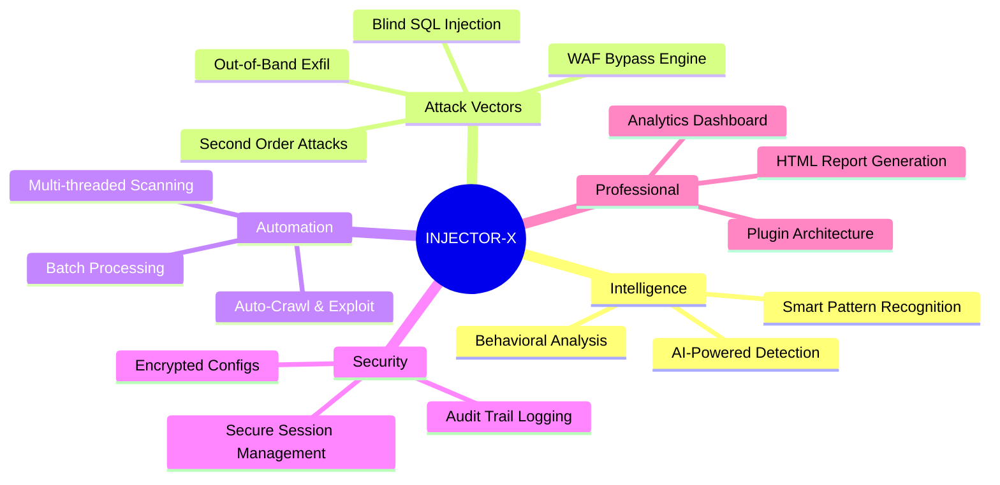
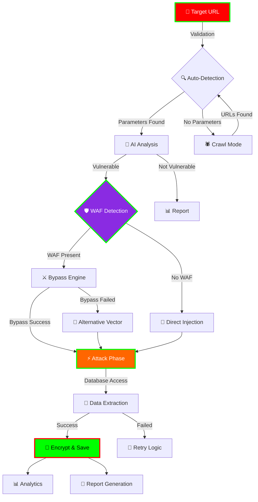
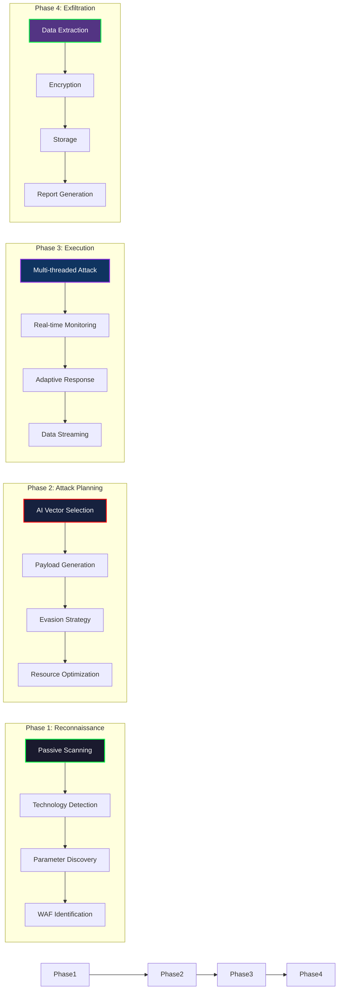
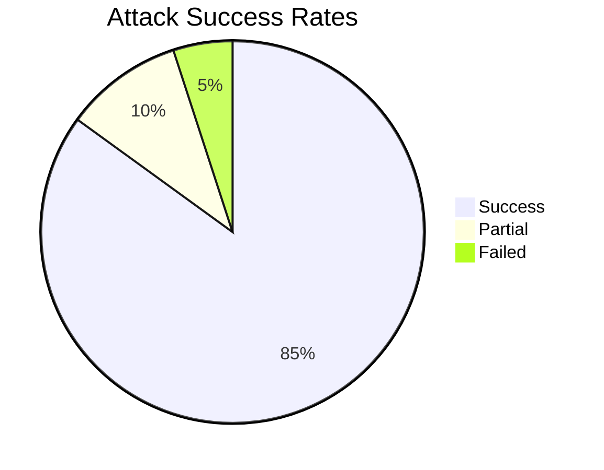
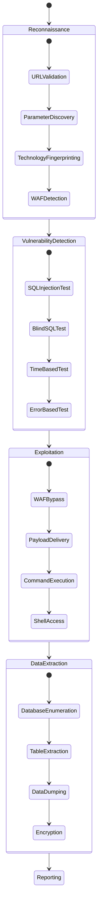
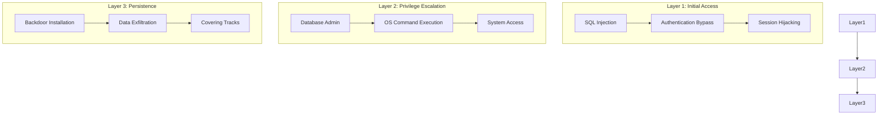
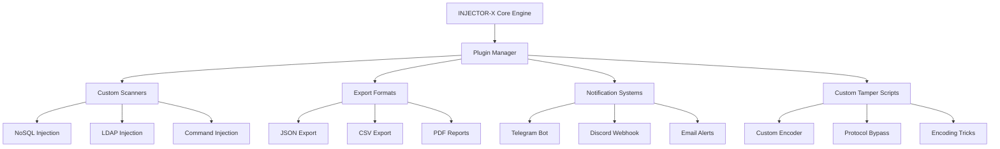
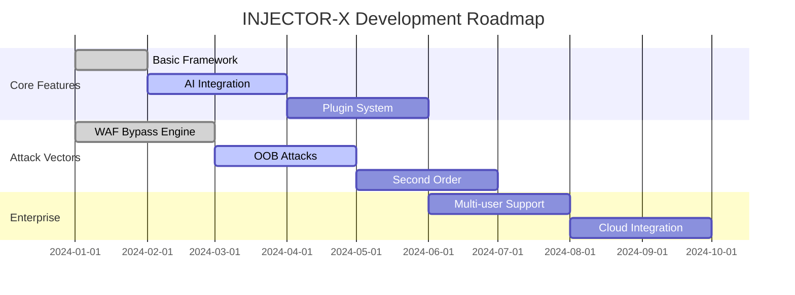

<a href="https://github.com/Athexblackhat/INJECTOR-X"></a> 


## ⚡ INJECTOR-X

***What is INJECTOR-X?***

INJECTOR-X is a professional-grade SQL injection automation framework designed for security researchers, penetration testers, and ethical hackers. Built on top of the powerful SQLMap engine, it transforms complex command-line operations into an intuitive, feature-rich interactive experience with advanced capabilities for database extraction, vulnerability assessment, and security auditing.

<p align="center">
  
</p>


<p align="center">
  <a href="#-features">
    
  </a>
  <a href="#-installation">
    
  </a>
  <a href="#-attack-vectors">
    
  </a>
  <a href="#-documentation">
    
  </a>
</p>

<div align="center">
  
</div>

<br>

<div align="center">
  
***The INJECTOR-X strikes silently, leaving no trace behind***
*Advanced SQL Injection Framework for Professionals*

</div>

<br>

# 📊 LIVE STATISTICS

<p align="center">


</p>

<p align="center">

</p>

---

# 🎯 OVERVIEW

<div align="center">

| **Feature** | **Description** | **Status** |
|:----------:|:---------------:|:----------:|
| 🚀 **Engine** | SQLMap Enhanced Core | `Active` |
| 🎯 **Precision** | AI-Assisted Detection | `Operational` |
| 🛡️ **Evasion** | 12+ WAF Bypass Techniques | `Armed` |
| ⚡ **Speed** | Multi-threaded Operations | `Optimized` |
| 🔐 **Security** | AES-256 Encryption | `Secured` |
| 📊 **Analytics** | Real-time Dashboard | `Live` |

</div>

<br>

## 🌟 WHY INJECTOR-X?




## ATTACK FLOW ARCHITECTURE     




## ⚔️ ATTACK VECTORS & TECHNIQUES

🎯 Injection Methodology Matrix



## 🚀 QUICK START

```
git clone --depth 1 https://github.com/Athexblackhat/INJECTOR-X.git
cd INJECTOR-X
chmod +x *
./run.sh
```


## Success Rate Analysis




## 🛠️ ADVANCED FEATURES
🧬 Attack Vector Visualization



## 🎯 Multi-Layer Attack Strategy



## 🧩 PLUGIN ARCHITECTURE




## Creating Plugins

```
#!/bin/bash
# Example custom plugin: custom_scanner.sh

plugin_name="Custom NoSQL Scanner"
plugin_version="1.0"
plugin_author="Your Name"
plugin_description="Adds NoSQL injection detection capabilities"

# Plugin initialization
init_plugin() {
    echo "[*] Loading $plugin_name v$plugin_version"
    # Add custom functions here
}

# Register with INJECTOR-X
register_plugin "nosql_scanner" "init_plugin"

```


## 🔐 SECURITY & ETHICS
<div align="center">
⚠️  WARNING  ⚠️
This tool is for authorized security testing only!

✓ Only test systems you own
✓ Obtain written permission
✓ Follow responsible disclosure
✓ Comply with local laws

✗ Never use on unauthorized systems
✗ Don't cause damage
✗ Protect extracted data
✗ Follow ethical guidelines
</div>


## 📜 LICENSE
```
INJECTOR-X - Advanced SQL Injection Framework
Copyright (C) 2024 INJECTOR-X Team

This program is licensed for professional security testing only.
Unauthorized use for malicious purposes is strictly prohibited.

See LICENSE.md for full terms and conditions.
```

## 📊 PROJECT STATUS



<div align="center">  <br>
⚡ "In the world of cybersecurity, the Athex black hat never sleeps" ⚡
<br>  <br>
<sub>© 2026 INJECTOR-X. All rights reserved. For authorized security professionals only.</sub>

</div> ```